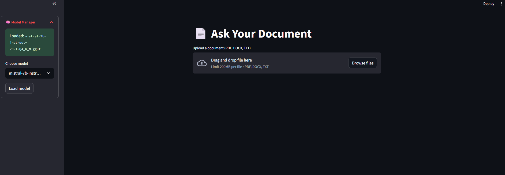

# 🧠 Local Document Q&A System

This project is a **fully local, privacy-first document Q&A system**, designed to help you search, explore, and interact with your own documents — securely and efficiently. It supports real-time ingestion of PDF, DOCX, and TXT files, applies semantic chunking and vector embedding, and uses a locally hosted LLM for natural-language answers in both single-turn and multi-turn formats.

The system prioritizes **modularity, observability, and full offline support**, making it suitable for personal knowledge bases, secure enterprise settings, or research workflows — all without sending data to the cloud.



---

## 🔭 Vision

This system aims to become a **powerful and private Retrieval-Augmented Generation (RAG) engine**, capable of:

- Ingesting large collections of documents across folders
- Answering questions with real-time citations
- Summarizing or comparing multiple documents
- Operating fully offline, powered by local vector DBs and LLMs
- Providing traceability and observability via Phoenix & OpenTelemetry

---

## 🔧 Architecture Overview

The system is built from modular, testable components:

### ✅ 1. **Embedding Service** (Dockerized or local)
- Runs a multilingual model (e.g., `intfloat/multilingual-e5-base`)
- Accepts batch inputs via a local FastAPI server
- Returns dense embeddings for semantic indexing

### ✅ 2. **Qdrant** (Vector Store)
- Stores document chunk embeddings + metadata (filename, page, position)
- Supports efficient top-k retrieval based on similarity
- Used for both retrieval and metadata tracking (checksums, ingestion status)

### ✅ 3. **Text-Generation-WebUI (TGW)**
- Runs your local LLM (e.g., Mistral, GPTQ, GGUF)
- Accessible via OpenAI-compatible API (`/v1/chat/completions` or `/v1/completions`)
- Works in both chat or completion mode

### ✅ 4. **Streamlit Frontend**
- Upload files and folders
- Ask questions and receive cited answers
- Adjust LLM model, temperature, mode
- Switch between chat and completion

### ✅ 5. **Phoenix Tracing**
- Observability layer based on OpenTelemetry + Arize Phoenix
- Captures span metadata for ingestion, embedding, retrieval, and LLM steps
- Uses OpenInference schema for standardized analytics

---

## 🚀 Key Features

- 🔍 Semantic search over local documents
- 📎 Supports multiple formats: PDF, DOCX, TXT
- 💬 Chat Mode (multi-turn)
- 🧠 Completion Mode (single Q&A)
- 📁 Multi-file + folder ingestion, with parallel processing
- 🧾 Source attribution (filename + page or position)
- 🗃️ File deduplication based on checksum
- 🧱 Modular architecture (easy to swap models or vector DB)
- 📊 Tracing and observability with Phoenix
- 🔒 Fully local: no cloud APIs, no internet needed

---

## 🧪 Usage Guide

### 📥 Ingest Documents
- Upload one or more files and/or folders
- Files are recursively scanned, chunked, embedded, and indexed
- Ingestion is logged and deduplicated via checksum tracking

### 💬 Ask Questions
- Choose between chat or completion mode
- Type natural-language questions (e.g., "What is this contract about?")
- System retrieves the most relevant document chunks and builds a prompt
- LLM answers using local knowledge + sources

### 🧠 LLM Controls
- Model, temperature, and mode are adjustable in sidebar
- Supports any LLM with OpenAI-compatible endpoints

---

## 🧰 Requirements

- Python 3.10+
- Qdrant running (Docker or native)
- OpenSearch
- Redis server for Celery broker
- Celery worker for async embedding
- Text-Generation-WebUI with a loaded model
- Dockerized embedder API

---

## 📌 Current Status

- ✅ Ingestion supports mixed file/folder input, with deduplication
- ✅ Modular pipeline orchestrated by `ingestion.py`
- ✅ Phoenix tracing across ingestion and QA flows
- ✅ Vector store: Qdrant only (no SQLite)
- ✅ Source filenames and pages displayed with each answer
- ✅ Batched embedding via API and Celery
- ✅ Works with both chat and completion LLMs (e.g. Mistral, GPTQ)
- ✅ Query rewriting layer supports clarification and intent extraction
- ✅ Progress bar and estimated time remaining during ingestion
- ⚠️ Streaming answers (token-by-token) is currently disabled

---

## 🔎 Query Rewriting (New Feature)

The system includes a **dedicated LLM-based query rewriter** that improves search accuracy by:

- ✅ Detecting vague or ambiguous questions (e.g., “What about that contract?”)
- ✅ Asking for clarification when context is missing (e.g., “Who is ‘he’?”)
- ✅ Rewriting clean questions into compressed, keyword-rich search phrases


### 🔧 How it works:

- All user queries are passed through a **chat-tuned query rewriter**

- The rewriter returns one of:

  ```json
  { "clarify": "Who are you referring to with 'he'?" }
  ```

  or

  ```json
  { "rewritten": "Ali assistant professor work years" }
  ```

- If clarification is needed, the main pipeline halts and returns the message to the user

### 📌 Why this matters:

- Reduces retrieval noise from vague or malformed queries
- Enhances accuracy when using local LLMs + vector search
- Handles grammar errors, typos, lack of punctuation, and missing context

### ✅ Tracing Integration

- The `qa_chain` trace includes a "Rewrite Query" span
- It records:
  - Original user query
  - Rewritten form
  - Clarification flag (if applicable)

---

## 🛣️ Roadmap

### ✅ Completed
These milestones are fully implemented and working in the system:

- [x] Query rewriting (clarify + keywords)
- [x] Hybrid search (BM25 + dense vectors)
- [x] Embedder API + Celery pipeline
- [x] Multi-file + folder ingestion
- [x] Phoenix tracing (QA + ingestion)
- [x] Deduplication + full path display
- [x] Progress bar + ETA during ingestion

### 🔧 Near-Term Enhancements
Next steps actively being planned or started:

- [ ] Index viewer & manager UI (status, re-sync, stats, delete)
- [ ] Reranker (cross-encoder or LLM-based)
- [ ] Per-document QA mode
- [ ] Session save/load for chat + files

### 🔮 Coming Next
Mid-term roadmap items queued for future sprints:

- [ ] Batch summarization (map-reduce)
- [ ] Advanced chunking (semantic, LLM-aided)
- [ ] Offline Docker bundle (TGW + Embedder + Qdrant + OpenSearch)
- [ ] Agent workflows (document reasoning)

---

