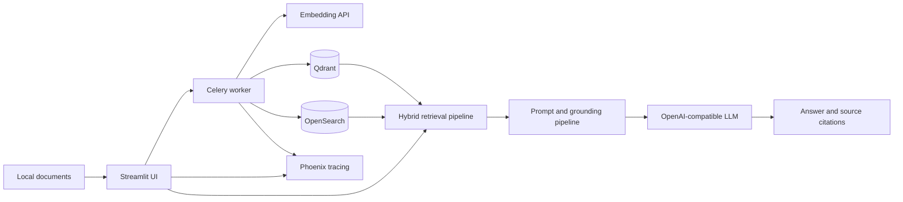

# Local Document Q&A

Local Document Q&A indexes documents and answers questions against retrieved evidence. Unlike a hosted chat-with-files service, its storage, retrieval, embedding, generation, and tracing endpoints are configurable and can run on infrastructure you control. The implemented pipeline combines OpenSearch lexical search with Qdrant dense retrieval, returns source metadata with answers, and exposes traces for inspecting pipeline behavior. Local deployment improves data control, but operators must still secure ports, logs, model services, and the host filesystem.


## Features

- PDF, DOCX, and text ingestion with chunk metadata and checksum/path deduplication
- Hybrid retrieval over OpenSearch and Qdrant, with configurable fusion, MMR, query variants, and an optional reranker
- OpenAI-compatible local LLM integration and an optional Groq provider
- Source filename/page or position metadata shown with generated answers
- Streamlit pages for chat, ingestion, search, index inspection, duplicates, watchlists, task administration, and topic discovery
- Celery/Redis asynchronous ingestion workers
- OpenTelemetry/Phoenix tracing for ingestion and QA pipeline inspection
- Retrieval and QA handoff evaluation scripts with checked-in evaluation fixtures and prior run artifacts

See [Architecture](docs/architecture.md) for component boundaries and [Pipeline map](docs/pipeline_map.md) for code-level flow.

## Architecture


```mermaid
flowchart LR
    D[Local documents] --> UI[Streamlit UI]
    UI --> C[Celery worker]
    C --> E[Embedding API]
    C --> OS[(OpenSearch)]
    C --> Q[(Qdrant)]
    UI --> R[Hybrid retrieval pipeline]
    OS --> R
    Q --> R
    R --> P[Prompt and grounding pipeline]
    P --> L[OpenAI-compatible LLM]
    L --> A[Answer and source citations]
    UI --> PH[Phoenix tracing]
    C --> PH
```

The repository does not bundle an LLM server. The default embedding container requires CUDA; CPU operation needs an override described in [Setup](docs/setup.md).

## Reproducible retrieval benchmark

The repository includes a manual six-stage benchmark pipeline that separates expensive corpus preparation from retrieval evaluation:

```text
source → parse → chunk → embed → OpenSearch/Qdrant index → evaluate
```

Each stage writes a lineage manifest with content/configuration fingerprints. Canonical source, parsed, chunked, embedding, and native-index artifacts are persisted privately in a Hugging Face Storage Bucket; completed compatible artifacts and checkpoints can be reused instead of recomputing upstream work. The current index contract pins OpenSearch 3.8.0 and Qdrant 1.19.1. See [Evaluation](docs/evaluation.md) for composition, invalidation rules, storage layout, and workflow details.

The current `composite-v2` regression benchmark contains five tracks: Open RAGBench, OfficeQA, NFCorpus, MIRACL German, and MIRACL Arabic. It evaluates 410 fixed queries. Open RAGBench is a controlled corpus-scale experiment: the same 80 positive PDFs and 160 questions used in `composite-v1` are retained, while its corpus grows from 200 to 1,000 PDFs by adding 800 deterministic non-gold distractors. These added documents were not selected by this system's retrieval scores and are not described as semantically mined hard negatives.

### Composite-v2 full retrieval result

Full Benchmark 6 run: 410 queries, 0 evaluation errors.

| Track | Recall@1 | Recall@3 | Recall@5 | MRR | nDCG@5 | p95 ms |
| --- | ---: | ---: | ---: | ---: | ---: | ---: |
| MIRACL Arabic | 0.3556 | 0.5933 | 0.7572 | 0.6957 | 0.6726 | 11.2 |
| MIRACL German | 0.1749 | 0.4251 | 0.5495 | 0.5857 | 0.4950 | 11.8 |
| NFCorpus | 0.0143 | 0.0356 | 0.0405 | 0.2650 | 0.1621 | 12.8 |
| OfficeQA | 0.0823 | 0.2347 | 0.2597 | 0.2473 | 0.2096 | 23.6 |
| Open RAGBench | 0.6875 | 0.9125 | 0.9437 | 0.7978 | 0.8350 | 35.0 |
| **Macro average** | **0.2629** | **0.4402** | **0.5101** | **0.5183** | **0.4749** | — |

For Open RAGBench, increasing the corpus from 200 to 1,000 PDFs changed Recall@1 from 0.7688 to 0.6875 and Recall@5 from 0.9563 to 0.9437. The larger corpus therefore displaced the relevant document from rank 1 more often while usually retaining it within the top five. Because all five tracks share the combined retrieval index, the additional documents also act as distractors for the other tracks.

These are project-regression results on deliberately subsetted/combined source benchmarks, not official scores for the upstream benchmarks and not a claim about general RAG accuracy.

## Quick start

### Prerequisites

- Python 3.10+ (CI uses Python 3.13)
- Docker Engine with the `docker compose` plugin
- For the default embedder: NVIDIA GPU, compatible driver, and NVIDIA Container Toolkit
- An OpenAI-compatible LLM server reachable at `http://localhost:5000` by default
- At least 4 GB RAM for OpenSearch and the Python application in addition to model memory; actual model RAM/VRAM and disk use depend on the selected embedding and generation models

### 1. Install

```bash
git clone <repository-url>
cd document-qa-llm
python -m venv .venv
source .venv/bin/activate  # Windows PowerShell: .venv\Scripts\Activate.ps1
python -m pip install --upgrade pip
python -m pip install -r requirements/app.txt -r requirements/worker.txt -r requirements/dev.txt
cp .env.example .env
mkdir -p sample_docs
```

### 2. Configure the minimum environment

For the default local endpoints, `.env.example` already contains usable non-secret values. Set `DOCUMENTS_PATH` to the host folder the worker may read and configure the LLM endpoint/model server. Do not commit `.env`.

```dotenv
DOCUMENTS_PATH=./sample_docs
LLM_BASE_URL=http://localhost:5000
USE_GROQ=false
```

All environment variables, defaults, and advanced switches are documented in [Configuration](docs/configuration.md).

### 3. Start services

Start the minimum data, queue, embedding, and worker services:

```bash
docker compose up -d qdrant opensearch redis embedder-api celery
```

Check their state and inspect failures before launching the UI:

```bash
docker compose ps
docker compose logs --tail=100 embedder-api celery
```

Phoenix tracing, OpenSearch Dashboards, and Flower are optional:

```bash
docker compose up -d phoenix opensearch-dashboards flower
```

### 4. Start the application

Start your separately managed OpenAI-compatible LLM server, then run:

```bash
streamlit run main.py
```

Open the URL printed by Streamlit (normally `http://localhost:8501`). For setup troubleshooting, CPU embedding, service ports, and shutdown commands, see [Setup](docs/setup.md).

> There is intentionally no one-command full startup claim: model selection, model download, GPU/CPU compatibility, and the external LLM server require operator choices that cannot be safely automated by this repository.

## Tests and checks

Install the requirements shown above, then run:

```bash
python -m pytest --cov -q --ignore=tests/e2e --disable-warnings
python -m compileall -q app core ingestion qa_pipeline services ui utils worker
```

Unit tests run automatically for pull requests and pushes to `master`. E2E tests require Docker, OpenSearch, Qdrant, Playwright Chromium, and the repository's stub services, so maintainers launch them manually from the **E2E Tests** workflow in GitHub Actions. Run E2E before releases and before merging changes that affect navigation, ingestion, retrieval, backend integration, or E2E infrastructure. The workflow orchestration is documented in [`.github/workflows/e2e.yml`](.github/workflows/e2e.yml), while evaluation commands and the meaning of stored results are documented in [`docs/evaluation.md`](docs/evaluation.md).

## Minimum vs. optional services

| Component | Minimum interactive setup | Notes |
| --- | --- | --- |
| OpenSearch | Required | Lexical/full-text indexes; local Compose disables security |
| Qdrant | Required | Dense vectors and metadata |
| Redis + Celery | Required for asynchronous ingestion | Worker mounts only `DOCUMENTS_PATH` read-only |
| Embedding API | Required | Default Compose configuration uses CUDA |
| OpenAI-compatible LLM | Required for generated answers | External to this Compose file |
| Phoenix | Optional | Trace collection and inspection |
| OpenSearch Dashboards | Optional | OpenSearch inspection UI |
| Flower | Optional | Celery monitoring; unauthenticated in local Compose |
| Groq | Optional | Sends prompts/context to a third-party API; requires `GROQ_API_KEY` |
| Cross-encoder reranking | Optional, off by default | Served by the embedding API; adds model memory and latency |

## Project status

This is an early-stage open-source project. It has unit/UI tests and evaluation tooling, but it is not presented as production-ready. Defaults are designed for a trusted local development machine: several service ports are host-accessible, OpenSearch authentication is disabled, Flower is unauthenticated, document-level authorization is not implemented, and generated answers still require source verification. Streaming answer display is currently disabled.

Past evaluation artifacts under `docs/runbooks/` describe specific fixtures and configurations; they are not general benchmarks or guarantees for other corpora.

The [public repository audit](docs/public-repository-audit.md) identifies personal path/filename metadata in historical evaluation artifacts that the owner must review before publication.

## Roadmap

- Make Compose profiles for CPU/GPU embedding and optional observability services
- Add authenticated/network-hardened deployment guidance
- Expand retrieval, answer-support, citation-accuracy, refusal, and latency evaluation coverage
- Define a stable pre-1.0 configuration and migration policy
- Improve accessibility and cross-platform setup verification

Roadmap items are proposals, not commitments. Discuss large changes in an issue before implementation.

## Contributing

Contributions are welcome. Read [CONTRIBUTING.md](CONTRIBUTING.md) for setup, tests, pull-request expectations, and evaluation requirements. Community participation is governed by the [Code of Conduct](CODE_OF_CONDUCT.md); report vulnerabilities privately as described in [SECURITY.md](SECURITY.md).

## License

Licensed under the [Apache License 2.0](LICENSE). Copyright 2026 Ali Abul Hawa.

## Acknowledgements

This project builds on open-source components including Streamlit, OpenSearch, Qdrant, Celery, Redis, Sentence Transformers, Arize Phoenix, LangChain document utilities, and the Python scientific ecosystem. Their names identify dependencies and do not imply endorsement.

AI coding tools have been used as implementation accelerators in parts of this project; architecture review, evaluation, debugging, and maintenance remain the project owner's responsibility.
