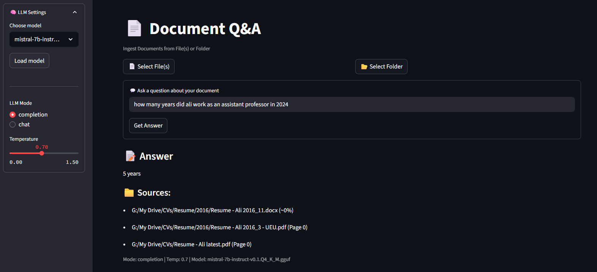

# 🧠 Document Q&A with Local LLM

Ask questions about your documents using a locally hosted large language model (LLM). This project combines [text-generation-webui](https://github.com/oobabooga/text-generation-webui) for local inference with a user-friendly [Streamlit](https://streamlit.io/) app for uploading and querying PDF, DOCX, or TXT files.

## 🚀 Features

- 📄 Upload documents (PDF, DOCX, TXT)
- 💬 Ask questions and get answers from a local LLM
- 🧠 Uses embedding-based retrieval + context-aware completions
- 🤖 Switch and load models via a built-in model manager
- 🔐 100% local, no external API calls required

## 🏗️ Stack

- [Streamlit](https://streamlit.io/) for the frontend
- [LangChain](https://www.langchain.com/) for document parsing and chunking
- [text-generation-webui](https://github.com/oobabooga/text-generation-webui) (with OpenAI-compatible API)
- Embeddings via `intfloat/multilingual-e5-base` (HuggingFace)
- Conda for environment management

## 🖼️ Interface



## 📂 Project Structure

```
document_qa/
├── ingest.py # Load & embed docs into vector store
├── ask.py # Query the LLM using retrieved context
├── streamlit_app.py # Main Streamlit app
├── requirements.txt # Python dependencies
├── data_store/ # Vector DB (FAISS or Pickle)
├── docs/ # Uploaded documents
└── assets/ # UI screenshots, logos, etc.
```

## ⚙️ Usage

1. **Start the local LLM** using text-generation-webui:
   ```bash
   start_windows.bat --api
   ```

2. **Launch the Streamlit app**:
   ```bash
   streamlit run streamlit_app.py
   ```

3. **Visit**: [http://localhost:8501](http://localhost:8501)  
   Upload a document, select a model, and start asking questions!

## 📝 Roadmap

- [x] Model loading via UI
- [x] Document embedding and storage
- [x] Streamlit interface
- [ ] Multi-document support
- [ ] Chunk viewer and source highlighting
- [ ] Support for other embedding models
- [ ] Docker containerization

## 📜 License

MIT

---

Want to showcase your NLP + LLM skills? Fork this project or use it as a template to build your own knowledge assistant.
