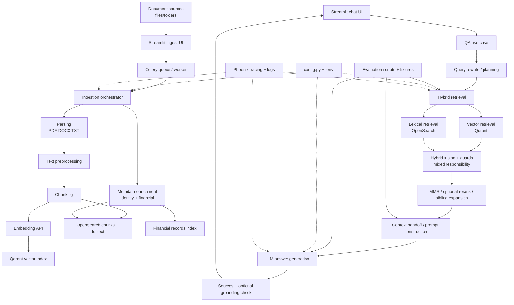

# Document QA Repository And Pipeline Map

Date: 2026-05-07

Scope: repository inspection only. No files were moved, renamed, refactored, or
functionally changed when this map was created.

## Summary

This project is more mature than a simple RAG demo. It includes:

- document ingestion
- parsing for PDF, DOCX, and TXT
- preprocessing and character-based chunking
- dense embedding through a local FastAPI embedding service
- vector storage in Qdrant
- lexical/full-text storage and retrieval in OpenSearch
- hybrid retrieval with fusion, deduplication, MMR, optional reranking, sibling
  expansion, and abstention logic
- query rewriting and optional query planning
- prompt/context construction
- local/OpenAI-compatible LLM answer generation
- optional grounding checks
- financial document enrichment and financial-query answer handling
- Streamlit UI
- legacy Gradio UI
- Celery worker ingestion
- Docker Compose local infrastructure
- retrieval, QA handoff, and financial evaluation scripts
- unit, UI, and e2e tests

The main issue is not missing functionality. The main issue is that ownership is
spread across several layers: `core/`, `ingestion/`, `qa_pipeline/`, `utils/`,
`app/usecases/`, `pages/`, `services/`, and `scripts/`.

Some boundaries are clear. Others are historical or compatibility-driven.

## Current Repository Map

| Path | What it appears to do | Type | Clarity |
|---|---|---|---|
| `README.md` | Project overview, setup, architecture, UI direction, features | Documentation | Mostly clear, partly outdated in wording |
| `AGENTS.md` | Project-specific working rules and portfolio/learning goals | Documentation | Clear |
| `config.py` | Central env/config for indexes, Qdrant, OpenSearch, LLM, embedding, retrieval, logging | Configuration/core | Clear but very broad |
| `.env.example` | Example runtime settings | Configuration | Clear |
| `docker-compose.yml` | Qdrant, OpenSearch, Redis, Celery, Phoenix, embedder service, Flower | Deployment/MLOps | Clear |
| `main.py` | Streamlit top-level navigation | UI/frontend | Clear |
| `tracing.py` | Phoenix/OpenTelemetry helper spans | Observability | Clear |
| `file_picker.py` | Native file/folder picker helper | UI utility | Clear |
| `app/` | Schemas, use cases, app cache, version metadata | App/backend layer | Mostly clear, but some use cases render Streamlit pages |
| `app/schemas.py` | UI-agnostic request/response dataclasses | API/backend contract | Clear |
| `app/usecases/` | Use-case wrappers for QA, ingestion, search, admin, topics, watchlist | Backend/application orchestration | Mixed: some are UI-agnostic, some execute Streamlit pages |
| `app/cache/` | In-memory app/infra cache | Backend utility | Clear |
| `pages/` | Active Streamlit pages: chat, ingest, search, index, admin, topics, tools | UI/frontend | Clear, but several files are large |
| `ui/` | Streamlit UI helpers, Celery client/admin helpers, topic discovery UI components | UI/frontend helpers | Mostly clear |
| `components/` | Small reusable Streamlit components | UI/frontend | Clear |
| `ui_gradio/` | Legacy Gradio app and tabs | Legacy UI/frontend | Clear as legacy, but still sizeable |
| `ingestion/` | Current ingestion package: orchestrator, loading, preprocessing, storage, classification, finance extraction | Core ingestion | Clear |
| `ingestion/orchestrator.py` | Main single-document ingestion pipeline | Core ingestion | Clear but large/mixed |
| `core/` | Lower-level domain and infrastructure code: chunking, embeddings, LLM, retrieval, OpenSearch/Qdrant stores, sync tools | Core code | Mixed responsibilities |
| `core/retrieval/` | Hybrid retrieval pipeline, fusion, MMR, dedup, rerank, config/types | Core retrieval | Clear conceptually, large implementation |
| `qa_pipeline/` | End-to-end QA orchestration: rewrite, retrieve, handoff, prompt, LLM, grounding, financial answer | RAG/generation | Clear |
| `utils/` | File utilities, OpenSearch/Qdrant helpers, inventory, watchlist, timing, logging | Utilities/infrastructure | Mixed |
| `utils/opensearch_utils.py` | OpenSearch mappings, indexing, deletion, search, fulltext, logs | Storage utility | Too broad |
| `utils/opensearch/` | Thin wrappers around `opensearch_utils.py` | Storage utility | Clear as transitional wrappers |
| `services/` | Topic discovery, topic naming, file-vector services | Services/features | Mixed, especially `topic_naming.py` |
| `worker/` | Celery worker, task definitions, audit logging, worker Dockerfile | Backend/async/MLOps | Clear |
| `embedder_api_multilingual/` | FastAPI embedding and reranking service | Embeddings/rerank service | Clear |
| `scripts/` | Evaluation, backfill, migration, purge, seed, stub services | Scripts/evaluation/ops | Clear but broad |
| `tests/` | Unit, retrieval, ingestion, UI, e2e, evaluation-script tests and fixtures | Tests/evaluation | Clear |
| `tests/fixtures/` | Retrieval and financial evaluation fixtures | Evaluation | Clear |
| `docs/` | Plans, runbooks, archived eval outputs | Documentation/evaluation artifacts | Useful but not consolidated |
| `requirements/` | App, worker, shared, dev dependency pins | Configuration | Clear |
| `.github/workflows/` | Unit and e2e CI workflows | CI/MLOps | Clear |
| `assets/` | UI screenshots/images | Documentation assets | Clear |
| `typings/` | Local type stubs for optional libraries | Type support | Clear |
| `opensearch-backups/` | Mounted backup path for OpenSearch | Deployment/storage | Purpose clear, current usage unclear |
| `.cache`, `.pytest_cache`, `.venv_finance`, `__pycache__`, `.vscode` | Local/generated/dev artifacts | Local tooling | Not core |

## Pipeline-Stage Ownership Table

| Stage | Main files |
|---|---|
| Document ingestion | `pages/1_ingest.py`, `app/usecases/ingest_usecase.py`, `ui/ingest_client.py`, `worker/tasks.py`, `ingestion/orchestrator.py`, `utils/inventory.py` |
| Document parsing | `ingestion/io_loader.py`, `core/file_loader.py` |
| Text preprocessing | `ingestion/preprocess.py`, `core/document_preprocessor.py`, `core/text_preprocess.py` |
| Chunking | `core/chunking.py`, `ingestion/orchestrator.py`, `docs/runbooks/chunking_process.md` |
| Embeddings | `core/embeddings.py`, `embedder_api_multilingual/app.py`, `utils/qdrant_utils.py` |
| Indexing | `ingestion/storage.py`, `utils/qdrant_utils.py`, `utils/opensearch_utils.py`, `utils/opensearch/*`, `ingestion/financial_records_store.py` |
| Lexical retrieval | `core/opensearch_store.py`, `utils/fulltext_search.py` |
| Vector retrieval | `core/vector_store.py` |
| Hybrid fusion | `core/retrieval/pipeline.py`, `core/retrieval/fusion.py`, `core/retrieval/types.py` |
| Reranking | `core/retrieval/reranker.py`, `embedder_api_multilingual/app.py`, `config.py` |
| Query rewriting/planning | `core/query_rewriter.py`, `qa_pipeline/rewrite.py`, `core/retrieval/variants.py` |
| Prompt/context construction | `qa_pipeline/handoff.py`, `qa_pipeline/prompt_builder.py`, `qa_pipeline/coordinator.py` |
| Grounding/citations | `qa_pipeline/grounding.py`, `qa_pipeline/types.py`, `pages/0_chat.py` |
| Answer generation | `qa_pipeline/coordinator.py`, `qa_pipeline/llm_client.py`, `core/llm.py`, `qa_pipeline/financial_answer.py` |
| Evaluation | `scripts/run_retrieval_eval.py`, `scripts/run_qa_handoff_eval.py`, `scripts/run_financial_eval.py`, `scripts/analyze_retrieval_residual_failures.py`, `scripts/investigate_ranking_post_patha.py`, `tests/fixtures/*`, `docs/runbooks/*eval*` |
| API/backend | `app/schemas.py`, `app/usecases/*.py`, `worker/tasks.py`; embedder API is separate in `embedder_api_multilingual/app.py` |
| UI/frontend | `main.py`, `pages/`, `ui/`, `components/`, `ui_gradio/` |
| Configuration | `config.py`, `.env.example`, `requirements/`, `pytest.ini`, `docker-compose.yml` |
| Observability/logging | `tracing.py`, `utils/timing.py`, `utils/ingest_logging.py`, `worker/audit.py`, Phoenix service in `docker-compose.yml` |
| Tests | `tests/`, `tests/e2e/`, `tests/ui_apptest/` |
| Deployment/MLOps | `docker-compose.yml`, `worker/Dockerfile`, `embedder_api_multilingual/Dockerfile`, `.github/workflows/*`, `scripts/test.sh` |
| Scripts/utilities | `scripts/`, `core/sync/`, `utils/watchlist.py`, `utils/inventory.py` |

## Current Data Flow

### Document Ingestion Flow

1. The user selects files or folders in the Streamlit ingest page:
   - `pages/1_ingest.py`
2. The page creates an `IngestRequest` and calls:
   - `app/usecases/ingest_usecase.py`
3. The use case updates watch inventory and queues Celery jobs through:
   - `utils/inventory.py`
   - `ui/ingest_client.py`
4. The Celery worker receives the task:
   - `worker/tasks.py`
5. In Docker, the worker maps host paths to container paths using `DOC_PATH_MAP`.
6. The worker calls:
   - `ingestion.orchestrator.ingest_one()`

### Parsing And Preprocessing Flow

1. `ingest_one()` normalizes paths.
2. It computes checksum, file size, and timestamps through:
   - `ingestion/io_loader.py`
   - `utils/file_utils.py`
3. It checks existing fulltext and duplicate state through:
   - `ingestion/storage.py`
   - `utils/opensearch_utils.py`
4. It loads raw file content through:
   - `ingestion/io_loader.py`
   - `core/file_loader.py`
5. Parsing supports:
   - PDF through `PyPDFLoader`
   - DOCX through `Docx2txtLoader`
   - TXT through `TextLoader` with encoding fallbacks
6. Preprocessing runs through:
   - `ingestion/preprocess.py`
   - `core/document_preprocessor.py`
   - `core/text_preprocess.py`
7. Full-document text is built for the fulltext OpenSearch document.

### Chunking And Metadata Flow

1. Chunks are built by:
   - `core/chunking.py`
2. Chunking uses LangChain `RecursiveCharacterTextSplitter`.
3. Defaults come from `config.py`:
   - `CHUNK_SIZE=800`
   - `CHUNK_OVERLAP=100`
4. `ingestion/orchestrator.py` then adds file-level metadata:
   - deterministic chunk ID
   - file-level `chunk_index`
   - canonical `path`
   - `checksum`
   - `chunk_char_len`
   - file type
   - timestamps
   - byte size
   - page/location metadata
5. Identity metadata is added through:
   - `ingestion/doc_classifier.py`
6. Financial metadata and records are added through:
   - `ingestion/financial_extractor.py`
   - `ingestion/financial_records_store.py`

### Embedding And Indexing Flow

1. Chunks are embedded through:
   - `core/embeddings.py`
2. `core/embeddings.py` calls the local FastAPI embedder:
   - `embedder_api_multilingual/app.py`
   - endpoint: `/embed`
3. Vectors are stored in Qdrant through:
   - `utils/qdrant_utils.py`
4. Chunk documents and fulltext documents are stored in OpenSearch through:
   - `utils/opensearch_utils.py`
   - `utils/opensearch/*`
5. Qdrant stores a minimal payload:
   - `id`
   - `checksum`
   - `path`
6. OpenSearch is the source of truth for chunk text and metadata.
7. Financial sidecar records are stored in a separate financial records index.
8. Inventory is updated through:
   - `utils/inventory.py`

### Question Answering Flow

1. The user asks a question in:
   - `pages/0_chat.py`
2. The page creates a `QARequest` and calls:
   - `app/usecases/qa_usecase.py`
3. The use case resolves retrieval, reranking, HyDE, query-planning, grounding,
   and handoff settings from `config.py`.
4. It calls:
   - `qa_pipeline.answer_question()`
5. `qa_pipeline/coordinator.py` orchestrates:
   - query rewrite or planning
   - retrieval
   - context handoff/packing
   - financial answer path, if applicable
   - prompt construction
   - LLM answer generation
   - optional grounding check

### Retrieval Flow

1. Query rewriting/planning is handled by:
   - `core/query_rewriter.py`
   - `qa_pipeline/rewrite.py`
2. The coordinator calls:
   - `qa_pipeline/retrieve.py`
3. `qa_pipeline/retrieve.py` wires dependencies into:
   - `core/retrieval/pipeline.py`
4. Dense retrieval uses:
   - `core/vector_store.py`
   - Qdrant
5. Lexical retrieval uses:
   - `core/opensearch_store.py`
   - OpenSearch
6. Hybrid retrieval then applies:
   - query variants or planned variants
   - score normalization
   - fusion
   - authority and recency boosts
   - profile-intent adjustments
   - lexical rescue
   - hard-negative suppression
   - content-evidence guard
   - checksum deduplication
   - near-duplicate collapse
   - MMR
   - optional reranking
   - sibling expansion
   - financial gating, if applicable
   - out-of-corpus abstention

### Prompt, Answer, And Grounding Flow

1. Retrieved documents are optionally packed by token budget:
   - `qa_pipeline/handoff.py`
2. Prompt text is built by:
   - `qa_pipeline/prompt_builder.py`
3. LLM calls go through:
   - `qa_pipeline/llm_client.py`
   - `core/llm.py`
4. Source labels are built from retrieved document metadata.
5. Optional grounding checks are run by:
   - `qa_pipeline/grounding.py`
6. The result is normalized into a UI response by:
   - `app/usecases/qa_usecase.py`

### Evaluation Flow

Evaluation is script-driven, not UI-driven.

Main evaluation assets:

- `scripts/run_retrieval_eval.py`
- `scripts/run_qa_handoff_eval.py`
- `scripts/run_financial_eval.py`
- `scripts/analyze_retrieval_residual_failures.py`
- `scripts/investigate_ranking_post_patha.py`
- `tests/fixtures/retrieval_eval_queries.json`
- `tests/fixtures/retrieval_eval_answer_support_labels.json`
- `tests/fixtures/financial_eval_queries.json`
- `docs/runbooks/*eval*`

The project already has important retrieval-evaluation discipline. This is a
portfolio strength.

## Confusing Or Risky Structure

| Issue | Why it matters |
|---|---|
| `core/retrieval/pipeline.py` is very large | It mixes query variants, fusion, guards, profile logic, financial gating, sibling expansion, rerank, abstention, and ranking policies. This is the highest-value future extraction target. |
| `utils/opensearch_utils.py` is too broad | It owns mappings, chunk indexing, fulltext indexing, deletion, search, logs, financial mappings, and duplicate utilities. Wrappers in `utils/opensearch/*` partially hide that. |
| `services/topic_naming.py` is extremely large | It mixes topic profiling, OpenSearch keyword logic, Qdrant vectors, LLM naming, caching, metrics, and postprocessing. |
| `app/usecases/*` is not consistently UI-agnostic | Some files are clean use cases; others render Streamlit pages by `runpy.run_path`, which creates hidden path dependencies. |
| Active Streamlit plus legacy Gradio duplicates UI concepts | README says Gradio is legacy, but the code remains sizeable and duplicates tabs/flows. |
| `core/ingestion.py` is a compatibility shim | The real ingestion source of truth is `ingestion/orchestrator.py`; the shim is useful but can confuse readers. |
| Scripts rely on repo-root `sys.path` and relative paths | Moving scripts, fixtures, or runbooks could break direct execution. |
| Worker path mapping is Windows/container-specific | `DOC_PATH_MAP=C:/=>/host-c` is essential for Docker ingestion behavior. |
| Qdrant/OpenSearch split is non-obvious | Qdrant has minimal payloads; OpenSearch is required to hydrate text/metadata after vector search. |
| Docs are artifact-heavy, not architecture-first | There are strong runbooks and eval outputs, but no single current architecture or file-ownership document. |

### Incidental Findings

| Severity | Category | Files | Rationale | Recommended disposition | Duplicates backlog theme |
|---|---|---|---|---|---|
| Medium | Test reliability/navigation consistency | `tests/e2e/test_smoke_e2e.py`, `pages/0_chat.py`, `main.py` | E2E smoke appears to expect older heading text: "Talk to Your Documents", while the active UI says "Ask Your Documents". | later | navigation inconsistency / visual regression gaps |
| Low | Cleanup/test noise | `tests/e2e/test_search_smoke.py` | Contains debug-looking print output. | parked | lint/cleanup debt |

## Proposed Target Structure

Do not implement this structure without a separate plan and approval. This is a
directional structure adapted to the current repository.

```text
document_qa/
  config/
    settings.py
    logging.py

  ingestion/
    orchestration.py
    parsing/
      loaders.py
    preprocessing/
      text_preprocess.py
      document_preprocessor.py
    chunking/
      splitters.py
    enrichment/
      identity.py
      financial.py
    storage.py

  storage/
    opensearch/
      client.py
      indexes.py
      chunks.py
      fulltext.py
      financial_records.py
      ingest_logs.py
    qdrant/
      client.py
      vectors.py
      file_vectors.py

  retrieval/
    planning.py
    lexical.py
    vector.py
    hybrid/
      fusion.py
      pipeline.py
      policies.py
      dedup.py
      mmr.py
    reranking.py

  generation/
    coordinator.py
    handoff.py
    prompt_builder.py
    llm_client.py
    financial_answer.py

  grounding/
    citations.py
    grounding.py

  evaluation/
    retrieval_eval.py
    qa_handoff_eval.py
    financial_eval.py
    analysis.py

  api/
    schemas.py
    usecases/

  ui/
    streamlit/
      main.py
      pages/
      components/
    gradio_legacy/

  observability/
    tracing.py
    timing.py

  security/
    README.md

worker/
scripts/
tests/
docs/
embedder_service/
```

The exact names matter less than the ownership model:

- ingestion owns document-to-index flow
- storage owns OpenSearch/Qdrant persistence
- retrieval owns candidate selection and ranking
- generation owns prompt/LLM/answer construction
- grounding owns support checks and citation contracts
- evaluation owns measurable quality checks
- UI owns interaction only
- worker owns async execution
- observability owns tracing/logging

## Refactor Phases

| Phase | Goal | Likely files | Risk | Benefit | Tests/eval |
|---|---|---|---|---|---|
| Phase 1: documentation only | Create owner-facing maps before moving anything | `docs/pipeline_map.md`, `docs/architecture.md`, `docs/file_ownership.md`, `docs/retrieval_pipeline.md`, `docs/evaluation.md`, `docs/api_flow.md` | Very low | Immediate learning and portfolio clarity | No code tests required |
| Phase 2: safe grouping/renaming | Only move or group files with clear wrappers and tests | Possibly docs first; later `utils/opensearch/*`, legacy UI docs, script docs | Low-medium | Reduces navigation cost | `pytest tests/test_opensearch_utils*.py tests/test_dependency_boundaries.py -q` |
| Phase 3: interface cleanup | Make ingestion/retrieval/generation contracts explicit | `core/retrieval/pipeline.py`, `qa_pipeline/*`, `ingestion/orchestrator.py`, `app/usecases/*` | Medium-high | Defensible architecture and easier debugging | Retrieval, QA, ingestion, UI tests |
| Phase 4: tests/evaluation stabilization | Make before/after evaluation routine and credible | `scripts/run_*eval.py`, `tests/fixtures/*`, `docs/runbooks/*` | Medium | Portfolio-grade evaluation discipline | Retrieval eval, QA handoff eval, financial eval |
| Phase 5: optional MLOps/cloud | Harden local/docker/CI/deployment story | Dockerfiles, `docker-compose.yml`, `.github/workflows/*`, env docs, health checks | Medium | Production-readiness story | Unit tests, e2e tests, service smoke tests |

## Visual Architecture Output



## Documentation Linkage Map

| Component | Main files | Current documentation | Missing documentation | Recommended doc file |
|---|---|---|---|---|
| Overall architecture | `README.md`, `main.py`, `app/`, `qa_pipeline/`, `ingestion/`, `core/` | `README.md` | Current consolidated architecture map | `docs/architecture.md` |
| Pipeline/file ownership | Most repo folders | This file | Deeper file ownership guide | `docs/file_ownership.md` |
| Ingestion | `ingestion/orchestrator.py`, `ingestion/*`, `worker/tasks.py` | Strong docstring in `ingestion/orchestrator.py` | External ingestion guide | `docs/ingestion_pipeline.md` |
| Chunking | `core/chunking.py`, `ingestion/preprocess.py` | `docs/runbooks/chunking_process.md`, `docs/runbooks/chunk_size_migration.md` | Mostly covered | `docs/retrieval_pipeline.md` can link existing runbooks |
| Embeddings/indexing | `core/embeddings.py`, `utils/qdrant_utils.py`, `utils/opensearch_utils.py` | `utils/qdrant_utils.py` docstring | Storage architecture doc | `docs/storage_and_indexing.md` |
| Retrieval | `core/retrieval/*`, `core/vector_store.py`, `core/opensearch_store.py` | Runbooks/eval artifacts exist | Human-readable retrieval pipeline doc | `docs/retrieval_pipeline.md` |
| Reranking | `core/retrieval/reranker.py`, embedder `/rerank` | `docs/runbooks/retrieval_cross_encoder_decision_2026-03-28.md` | How to safely re-evaluate reranking | `docs/retrieval_pipeline.md` |
| QA handoff | `qa_pipeline/handoff.py`, `qa_pipeline/coordinator.py` | `docs/runbooks/qa_handoff_policy_and_q04_plan_2026-03-28.md` | Stable policy explanation | `docs/qa_pipeline.md` |
| Prompt/generation | `qa_pipeline/prompt_builder.py`, `core/llm.py`, `qa_pipeline/llm_client.py` | Partial tests | Prompt and answer contract doc | `docs/qa_pipeline.md` |
| Grounding/citations | `qa_pipeline/grounding.py`, `qa_pipeline/types.py`, `pages/0_chat.py` | Missing | Grounding limitations and citation contract | `docs/grounding_and_citations.md` |
| Evaluation | `scripts/run_retrieval_eval.py`, `scripts/run_qa_handoff_eval.py`, `scripts/run_financial_eval.py`, fixtures | Many runbook artifacts | Stable evaluation guide | `docs/evaluation.md` |
| Financial retrieval | `ingestion/financial_extractor.py`, `qa_pipeline/financial_answer.py`, `core/financial_query.py` | `docs/plans/financial_tax_retrieval_plan.md`, implementation log | Current implemented behavior summary | `docs/financial_retrieval.md` |
| UI flow | `main.py`, `pages/`, `ui/`, `app/usecases/` | README sections | Active Streamlit flow and legacy Gradio boundary | `docs/api_flow.md` or `docs/ui_flow.md` |
| Worker/async | `worker/*`, `docker-compose.yml`, `ui/ingest_client.py` | README setup | Worker lifecycle and path mapping | `docs/worker_and_ingestion_ops.md` |
| Observability | `tracing.py`, `utils/timing.py`, Phoenix service | README mentions Phoenix | Span taxonomy and logs guide | `docs/observability.md` |
| Security/governance | Config, prompt, local data handling | README privacy claims | Prompt injection, data leakage, access control, PII policy | `docs/security_and_governance.md` |
| Deployment/MLOps | Dockerfiles, Compose, workflows | README setup, CI files | Deployment/health/env guide | `docs/deployment.md` |

## Smallest Safe Next Step

The first safe action was to create this documentation-only map:

- `docs/pipeline_map.md`

No code behavior should change from this step.

Recommended next documentation step:

- Create `docs/retrieval_pipeline.md` focused only on retrieval behavior,
  evaluation metrics, and defensible RAG interview explanations.

## Verification

No tests were run for this documentation-only artifact.

If a future edit changes code or configuration, run the smallest relevant tests
for that change. For retrieval-facing changes, also run the retrieval evaluation
scripts and compare before/after metrics.

## What The Owner Should Now Be Able To Explain

- How a document moves from file picker to Celery to parsing, chunking,
  embedding, Qdrant, OpenSearch, and inventory.
- Why Qdrant is not the metadata source of truth.
- How a user question moves through rewrite/planning, hybrid retrieval, fusion,
  context packing, prompt construction, LLM generation, and grounding.
- Which files own retrieval quality versus answer generation versus UI display.
- Why retrieval evaluation is already a major asset of this project.
- Why the first improvement should be documentation, not refactoring.

